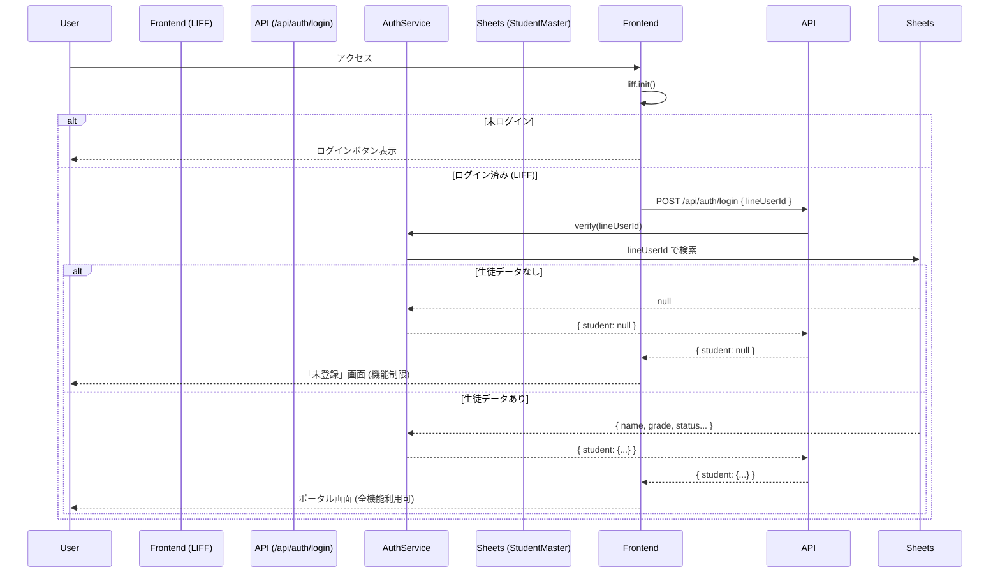

# アーキテクチャ設計書 (Architecture Overview)

本プロジェクトは、保守性・拡張性・テスト容易性を高めるために、**Feature-based Architecture**（機能単位のアーキテクチャ）と **Service Layer Pattern**（サービス層パターン）を採用しています。

## 1. ディレクトリ構成と役割
ディレクトリ構成は、Next.js App Router の標準に従いつつ、ビジネスロジックと UI を明確に分離するように設計されています。

```
src/
├── app/                    # Next.js App Router (ルーティング層)
│   ├── api/                # API Route Handlers (HTTPエンドポイント)
│   │   ├── auth/           # 認証関連 (login)
│   │   ├── booking/        # 予約関連 (reserveMeeting/registerRestDay)
│   │   └── occupancy/      # 混雑状況取得
│   ├── booking/            # 予約画面ページ (Server Components)
│   └── occupancy/          # 混雑状況画面ページ
│
├── components/             # 共有 UI コンポーネント
│   └── ui/                 # 汎用部品 (Button, PageHeader, GlassCard 等)
│       # ここにはビジネスロジックを持たせない。純粋な表示用。
│
├── features/               # 機能別モジュール (Domain Drivenに近い分割)
│   ├── booking/            # 予約機能に関わる UI / Components
│   │   └── components/     # TimeRangeSlider などドメイン固有の部品
│   └── occupancy/          # 混雑状況機能に関わる UI / Components
│       └── components/     # OccupancyCard, PrincipalControlPanel など
│
├── services/               # ビジネスロジック層 (Service Layer)
│   # ここがアプリケーションの「脳」です。Next.js に依存しない純粋な TS 関数。
│   ├── studentService.ts   # 生徒データの取得・変換
│   ├── calendarService.ts  # カレンダー連携・イベント生成
│   ├── lineService.ts      # LINE Messaging API 連携
│   └── authService.ts      # 認証ロジック
│
├── lib/                    # インフラ/ユーティリティ層
│   ├── api.ts              # フロントエンド用 API クライアント
│   ├── schema.ts           # Zod スキーマ (バリデーション定義)
│   ├── config.ts           # 環境変数・定数管理
│   ├── liff.tsx            # LINE LIFF SDK ラッパー
│   └── googleSheets.ts     # Google API クライアント初期化
│
└── types/                  # 型定義 (TypeScript Interfaces)
```

## 2. 設計思想 (Design Philosophy)

### A. 責務の分離 (Separation of Concerns)
各層の役割を厳密に定義し、依存方向を一方向に限定しています。

1.  **Presentation Layer (`src/app`, `src/features`)**:
    *   **役割**: 画面の描画とユーザー入力の受け付け。
    *   **ルール**: ビジネスロジックを極力書かない。「API クライアントを呼んで、結果を表示する」ことに徹する。
    *   **例**: `OccupancyCard` は表示に専念し、更新操作は `PrincipalControlPanel` が担当する（責務の分離）。
2.  **API Handler Layer (`src/app/api`)**:
    *   **役割**: HTTPリクエストの受付、入力バリデーション (Zod)、レスポンスの返却。
    *   **ルール**: ロジックは書かず、サービス層 (`src/services`) に処理を委譲する。
3.  **Service Layer (`src/services`)**:
    *   **役割**: 具体的な業務処理（「予約可能か判定する」「スプレッドシートから生徒を探す」）。
    *   **ルール**: Next.js の機能（`NextRequest`など）に依存させない。これにより、単体テスト (`Jest`) が容易になる。
4.  **Infrastracture Layer (`src/lib`)**:
    *   **役割**: 外部システム（Google, LINE）との通信詳細を隠蔽する。

## 3. UI/UX 実装パターン (UI Patterns)

### A. Granular Loading (きめ細やかな読み込み)
従来の「ロード中は画面全体をスケルトンにする」手法は、UXを損なうため廃止しました。
*   **個別更新**: 教室長が開館/閉館操作を行った際、操作された建物のカード**だけ**をスケルトン表示にします。
*   `PrincipalControlPanel` による操作ロックと `OccupancyCard` の `isLoading` Props を連動させています。

### B. パフォーマンス最適化 (React.memo)
リアルタイム性を確保するため、`OccupancyPage` は数秒ごとにポーリングを行いますが、以下の対策でチラつき（Flickr）を防止しています。
*   **コンポーネントのメモ化**: `PageHeader` などの静的コンポーネントを `React.memo` でラップし、不要な再レンダリングを阻止。
*   **Propsの定数化**: 親コンポーネントから渡す JSX やオブジェクトを定数 (`const`) として定義。

### C. 型安全性とバリデーション (Zod & TypeScript)
「入力は疑え」の原則に基づき、API の入り口で必ず **Zod** による検証を行います。
*   `src/lib/schema.ts` に全スキーマを集約。
*   型定義 (`src/types`) とスキーマ定義 (`src/lib/schema.ts`) を連携させ、コンパイル時と実行時の両方で安全性を担保します。

### D. 変更への強さ (Robustness)
外部依存（特に Google Sheets）の脆さをコードで吸収しています。
*   **動的カラムマッピング**: スプレッドシートの列順序が変わっても、ヘッダー名（「生徒LINEID」など）で検索するため、プログラムは壊れません。

## 4. データフロー

例：**生徒が面談予約をする場合**

1.  **UI**: ユーザーが日付を選択し「予約」ボタンを押す。
2.  **Client**: `api.booking.reserveMeeting(...)` を呼び出す。
3.  **API Route**: `/api/reserveMeeting` がリクエストを受信。
    *   Zod で `BookingRequest` スキーマと照合。不正なら即座に 400 エラー。
4.  **Service**: `calendarService.createMeetingEvent(...)` を呼び出す。
    *   空き状況を確認（将来実装予定）。
    *   Google Calendar API を叩いてイベント作成。
5.  **Service**: `lineService.sendPushMessage(...)` を呼び出す。
    *   生徒に完了通知を送る。
6.  **Response**: UI に成功 (`{ status: 'ok' }`) を返す。

## 5. 認証と権限 (Authentication & Authorization)

本システムでは、ユーザーの状態を以下の3段階で識別しています。

### ユーザーステート定義

| ステート | 判定条件 | 説明 | できること |
| :--- | :--- | :--- | :--- |
| **1. 未ログイン (Guest)** | LIFF SDK `liff.isLoggedIn()` が `false` | LINEアプリ外、またはログイン未完了の状態。 | • ログインボタンの表示のみ |
| **2. 未登録 (Unregistered)** | LIFFログイン済み (`lineId`有) だが、バックエンド (`AuthService`) が生徒データを返さない (`null`) | LINEログインはできているが、スプレッドシートに `lineId` が登録されていない（または間違っている）。 | • 「生徒登録が見つかりません」画面の表示<br>• ログアウト |
| **3. 生徒 (Student)** | LIFFログイン済み かつ バックエンドから正規の生徒データ (`Student`) が返却された | 正常な利用状態。 | • 在室状況の閲覧<br>• 面談予約<br>• 欠席登録 |

### 判定ロジックフロー

システムの認証フローは以下の通りです。



### 今後の拡張 (権限管理)
「講師モード」や「保護者モード」を追加する場合、`Student` オブジェクト（または新たな `UserContext`）に含まれる **Role** プロパティで分岐を行います。

1.  **スプレッドシート拡張**: `Role` 列を追加 (デフォルト: `student`)。
2.  **型定義拡張**: `UserContext` 型に `role: 'student' | 'teacher' | 'parent'` を追加。
3.  **UI分岐**: `src/app/layout.tsx` または各ページで `user.role` に基づいて表示を切り替え。
