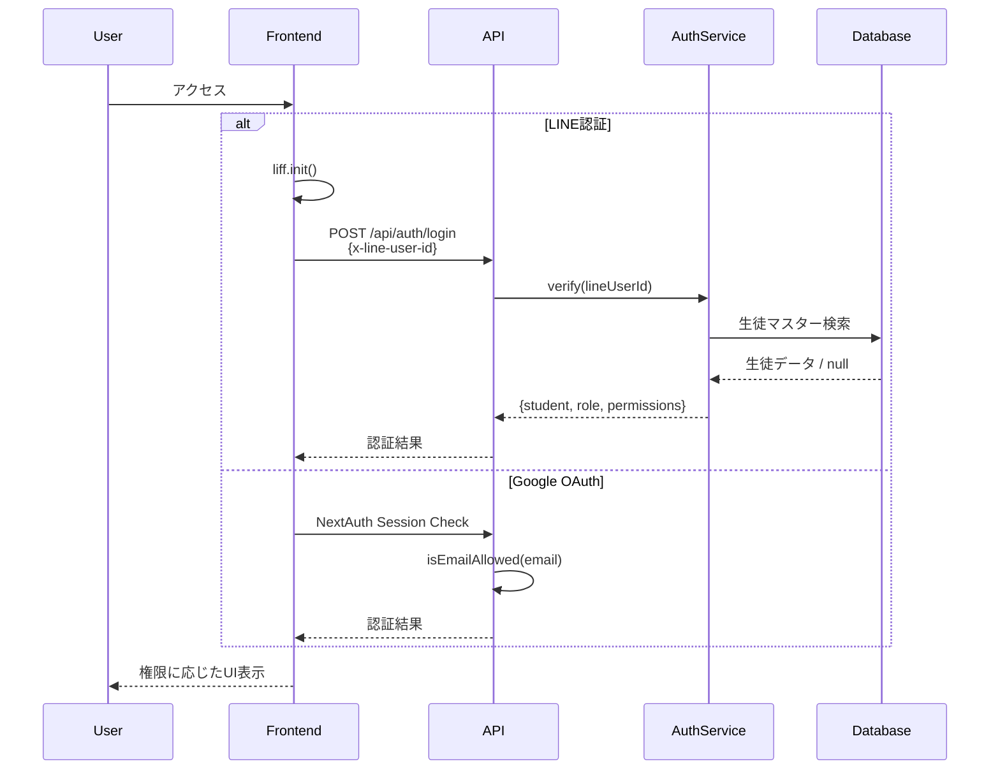

# 認証・権限システム (Authentication & Authorization)

本ドキュメントは、Seras学院生徒ポータルの認証・権限モデルを定義します。
APIエンドポイントのアクセス制御テストのための信頼できる情報源（Single Source of Truth）です。

## 1. 認証方式 (Authentication Methods)

本システムでは**ハイブリッド認証**を採用し、2つの認証方式をサポートしています。

| 認証方式 | 対象ユーザー | 用途 | 実装 |
| :--- | :--- | :--- | :--- |
| **LINE LIFF** | 生徒・講師・教室長 | スマートフォンからのアクセス | `@liff/liff-types` |
| **Google OAuth** | 講師・教室長 | PCブラウザからのダッシュボードアクセス | `next-auth` v4 |

### 認証フロー



## 2. ユーザーロール (User Roles)

ユーザーは `status` と `grade` フィールド（生徒マスター）に基づいて分類されます。

| ロール | 判定条件 | 説明 |
| :--- | :--- | :--- |
| **Guest** | 未ログイン、または認識できない `status` | 公開情報のみアクセス可 |
| **Student** | LINE認証済み、`status: '在塾'` | 通常の生徒 |
| **Teacher** | Google認証済み、または `status: '在塾(講師)'` | 講師 |
| **Principal** | `status: '教室長'` | 管理者（教室長） |

### ロール判定ロジック (`src/lib/authUtils.ts`)

```typescript
// ロール判定の優先順位
if (student.status === '教室長') role = 'principal';
else if (student.grade === '講師' || student.status.includes('講師')) role = 'teacher';
else role = 'student';
```

## 3. 権限設定 (Permissions)

権限は `src/lib/config.ts` で定義されています。

| 権限名 | 許可ステータス | 説明 |
| :--- | :--- | :--- |
| **VIEW_OCCUPANCY_MEMBERS** | `['教室長', '在塾(講師)', '在塾']` | 在室者リストの閲覧 |
| **OPERATE_BUILDING_STATUS** | `['教室長']` | 開館/閉館の操作 |
| **VIEW_DASHBOARD** | `['教室長', '在塾(講師)']` | ダッシュボードの閲覧 |

## 4. APIアクセスマトリクス

| エンドポイント | メソッド | Guest | Student | Teacher | Principal | 備考 |
| :--- | :---: | :---: | :---: | :---: | :---: | :--- |
| `/api/occupancy` | GET | ✅ | ✅ | ✅ | ✅ | 公開（詳細は権限による） |
| `/api/occupancy/status` | POST | ❌ | ❌ | ❌ | ✅ | 教室長のみ |
| `/api/ranking` | GET | ❌ | ✅ | ✅ | ✅ | 認証必須 |
| `/api/dashboard/stats` | GET | ❌ | ❌ | ✅ | ✅ | 講師・教室長のみ |
| `/api/dashboard/student-detail` | GET | ❌ | ✅* | ✅ | ✅ | *生徒は自分のデータのみ |
| `/api/auth/login` | POST | ✅ | ✅ | ✅ | ✅ | 認証エンドポイント |
| `/api/reserveMeeting` | POST | ❌ | ✅ | ✅ | ✅ | 予約機能 |
| `/api/registerRestDay` | POST | ❌ | ✅ | ✅ | ✅ | 欠席登録 |

## 5. 実装詳細

### サーバーサイド認証 (`src/lib/authUtils.ts`)

```typescript
// APIルートでの使用パターン
const auth = await authenticateRequest(req);

if (!auth.isAuthenticated) {
    return NextResponse.json({ error: 'Unauthorized' }, { status: 401 });
}

if (!auth.permissions.canViewDashboard) {
    return NextResponse.json({ error: 'Forbidden' }, { status: 403 });
}
```

### クライアントサイド認証 (`src/hooks/useRole.ts`)

```typescript
const { role, canViewDashboard, isLoading, displayName, authMethod } = useRole();

// 権限に応じたUI表示
if (canViewDashboard) {
    // ダッシュボードリンクを表示
}
```

### Google OAuth 設定

- **許可リスト**: 環境変数 `ALLOWED_EMAILS` で制御
- **表示名**: Google認証ユーザーは「Seras学院」として表示
- **権限**: 講師ロールとして扱われ、ダッシュボード閲覧可能

## 6. セキュリティテスト

上記のルールは `src/__tests__/integration/` の自動テストで検証されています。

| テストシナリオ | 検証内容 |
| :--- | :--- |
| **公開/保護の分離** | `/api/occupancy` は公開、`/api/ranking` はGuest拒否 (401) |
| **ダッシュボード保護** | 生徒が `/api/dashboard/stats` にアクセスすると 401/403 |
| **データプライバシー** | 生徒が他人のデータを閲覧しようとすると 403 |
| **操作権限** | `POST /api/occupancy/status` は教室長のみ許可 |

```bash
# テストの実行
npm test
```
